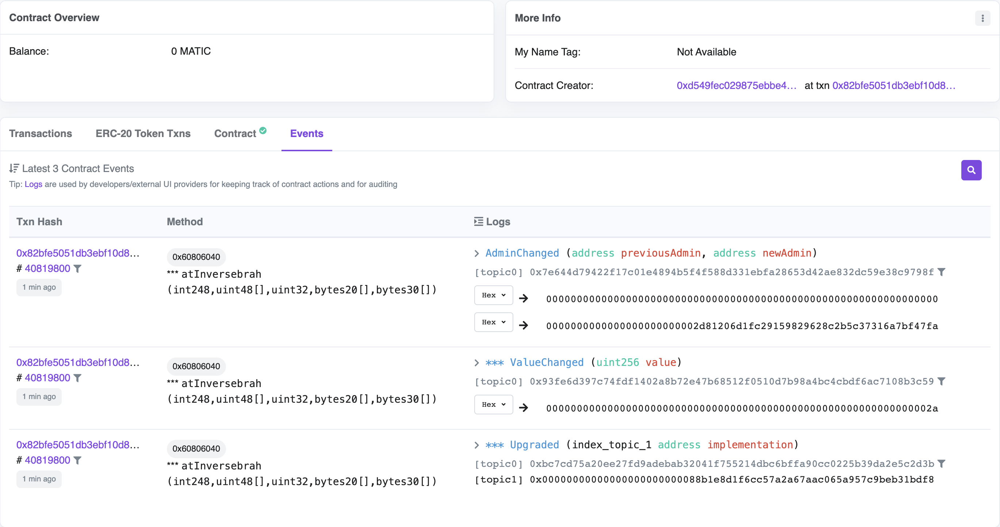
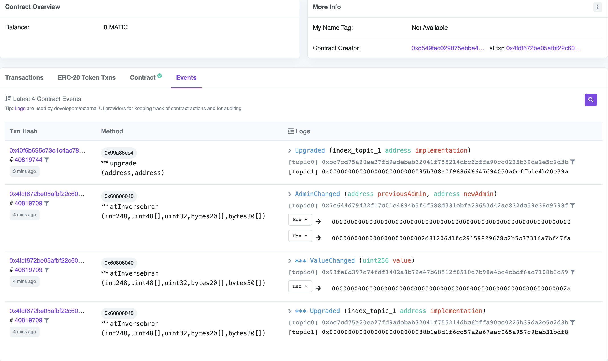

---
# Sample Upgradable Smart Contract Setup using OpenZeppelin and Hardhat

Creating upgradable smart contracts is an important aspect of smart contract development as it allows developers to fix bugs or introduce new features after a smart contract has been deployed. Solidity doesn't natively support upgradability due to the immutable nature of the blockchain. However, developers have devised various strategies to achieve upgradability.

One common approach for creating upgradable smart contracts is the proxy pattern, where a proxy contract forwards calls to an implementation contract. The proxy contract's storage remains intact, while the logic can be updated by changing the address of the implementation contract it points to. In this pattern, data storage is separated from the business logic of the contract. This setup allows the logic contract to be replaced while keeping the data intact.

OpenZeppelin Upgrades Plugins allow for the upgrading of smart contracts to modify their code while preserving their address, state, and balance.

This project demonstrates a sample setup of upgradable Solidity smart contracts on a Hardhat environment.

### Steps to Run the Project:
1. Install the necessary packages:
    ```shell
    npm i
    ```

2. This project deploys the contract to the Polygon Mumbai network, and uses an RPC URL from Alchemy. Fund the EOA (Externally Owned Account) with enough test MATIC to pay for gas. More information on funding can be found [here]

3. Create a `.env.local` file and add the private key of the EOA, so that it's available for the blockchain network configuration on `hardhat.config.js`. Refer to `hardhat.config.js` for the environment variable format. Example:
    ```shell
    PRIVATE_KEY='your-private-key-here'
    ```
    #### Deploying the upgradeable contract:
4. Run the following command to deploy the sample upgradable smart contract:
    ```shell
    npx hardhat run --network polygon_mumbai scripts/deploy_upgradeable_box.js
    ```

5. Copy the contract address as you need to specify the address of your proxy contract in order to upgrade it.

6. Explore the transaction and contract details on Polygon Mumbai Scan. Three events will be emitted, as seen in the screenshot below.

    

8. Replace the contract address on `scripts/upgrade_box.js` line 7 with your contract address.

    #### Upgrading the contract on chain
9. Run the following command to upgrade the implementation of the proxy contract:
    ```shell
    npx hardhat run --network polygon_mumbai scripts/upgrade_box.js
    ```

10. Explore the contract once again on Polygon Mumbai Scan, and you should be able to see the proxy upgraded event as seen in the screenshot below.
    

    #### Interacting with Upgraded Contracts:

11. Use the Hardhat console to interact with your upgraded contract:
    ```shell
    npx hardhat console --network polygon_mumbai
    ```

### Additional Resources:
- [OpenZeppelin Documentation](https://docs.openzeppelin.com/)
- [Hardhat Documentation](https://hardhat.org/getting-started/)
- [Proxy Pattern in Solidity]